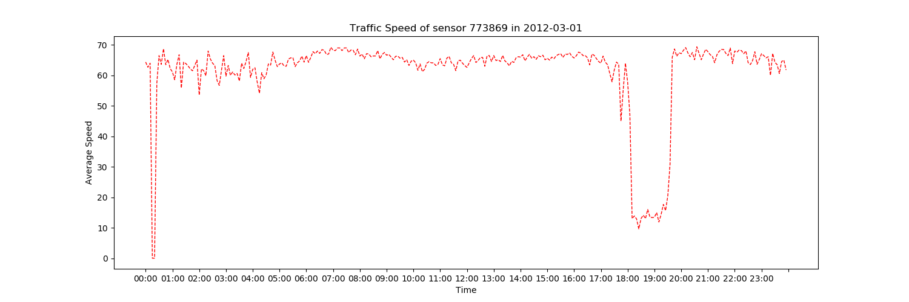

# Dataset Description

> In this document, multiple frequently used datasets in traffic flow prediction will be introduced. They vary in their size, content, publicity and accessibility. A fraction of them are accompanied with visualizations. Besides, frequent measurements used will also be displayed along with the easy Python code.

## METR-LA

This dataset comes from the communications of the ACM, 2014 Big Data and Its Technical Challenges. It’s the speed captured from the loop detectors installed in the highway of Los Angeles County. There are **207** sensors and the data are collected for 4 months from May 1st 2012 to Jun 30th 2012. The data was processed into **5 min windows**. Thus for each day, there are **288 samples/day** . The file is stored in `.h5` file and should be opened with python module `hd5y`. The data can be read with the following code

```Python
# ## Read the metr_la data
data_name = 'metr-la'
data_path = 'data/' + data_name + '.h5'
df = pd.read_hdf(data_path)
print(df.shape)
print(df)
```

In this way, the read dataframe is with shape **(34727, 207)**. The column is the sensor id while the index is the timestamp of the data caputred. The visualization of the data is as follows:



## PEMS-BAY

PEMS-Bay is collected b California Transportation Agencies Performance Measurement Systems. There are **325** sensors for **6 months** data ranging from 1st 2017 to May 31tst 2017. The data is still windowed in **5 min** window width. In can be read in the following code

```python
# ## Read the pems_bay data
data_name = 'pems-bay'
data_path = 'data/' + data_name + '.h5'
df = pd.read_hdf(data_path)
print(df.shape)
print(df)
```

In this way, the read dataframe is with shape **(52116, 325)**. The column is the sensor id while the index is the timestamp of the data caputred. The visualization of the data is as follows:


## NYC - Cars

The yellow and green taxk trips records includes fields capturing pick-up and drop-off dates/times, pick-up and drop-off locations, trip distances, itemized fares, rate types, payment types and drive-reported passenger counts.

The file is a `.csv` file and the size is pretty big. The fields are separated by `,`:

| name | example |
|---| --- |
| Vendor ID | 1|
|tpep_pickup_datetime|2019-01-01 00:46:40|
|tpep_dropoff_datetime|2019-01-01 00:53:20|
|passenger_count | 1|
|trip_distance| 1.50 (in miles)|
|RatecodeID| |1|
|store_and_fwd_flag|N|
|PULocationID|151|
|DOLocationID|239|
|payment_type|1|
|fare_amount|7|
|extra|0.5|
|mta_tax|0.5|
|tip_amount|1.65|
|tolls_amount|0|
|improvement_surcharge|0.3|
|total_amount|9.95|

> The congestion surcharge is listed in the `cvs` file but no records or explanations showed in the official document.

## Didi

The dataset is open to public in the [website](https://outreach.didichuxing.com/research/opendata/). The dataset collected the **POI Query Research** in Chengdu from *May 2018 to June 2018*. The data are in the form of `.txt`. The data distription are as follows

| name | type | example | remark |
| --- | --- | --- | --- |
| ID | String | KioqKioqMjc2NzM3MTk= | Processed for privacy |
| Text | String | 19b74075cf713ed74c07f273384c85eb 54b6b4288dceae8dbaf7d0cba64ba066 2b7fe880136b7a19abb09658168187f6 2b7fe880136b7a19abb09658168187f6 | Processed |
| Engage Latitude | String | 103.99341 | GCJ-02 |
| Engage Longitude | String | 30.66786 | CGJ-02 |
| POI name | String | 19b74075cf713ed74c07f273384c85eb 54b6b4288dceae8dbaf7d0cba64ba066 bc592cf93512632ad923368ecd74820f……a8bc895ec2eca9976e2be7543606622d | Processed |
| POI address | String | 75cf0ae50ee638a7713d03e2db823f41 5a4055dbdf86515579a0512a9f71c870 7dc14780350219c3b83961b789a65f47……c3632b787f5e08577954c684a7cbe92c | Processed |
| POI Latitude | String | 104.02022 | GCJ-02|
| POI Longitude | String | 30.7022 | GCJ-02|
| Click or not | String | 2 | 2: Yes, 1:No |
|Start/end | String |1 | 0: Search from start, 1: Search from destination |

There are two files: `chengdu_train.txt` with **652079** row number and `chengdu_test.txt` with **87703** row number
